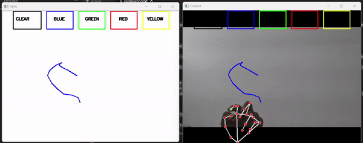

# Hand Gesture Paint

Ever wished to capture your imagination by just waving your finger in the air? Introducing Air Canvas, a virtual drawing tool that allows you to create drawings in the air using hand gestures. This computer vision project harnesses the power of OpenCV and MediaPipe to track hand landmarks and transform your movements into artwork.

## 🔧 Tools and Libraries Used:

- **Python3**
- **NumPy**
- **OpenCV:** An open-source library crucial for real-time computer vision tasks. It facilitates capturing and processing video frames from the webcam seamlessly.
- **MediaPipe:** Developed by Google, MediaPipe is an excellent framework for building multimodal machine learning pipelines. In this project, it is used for hand tracking, enabling accurate and real-time recognition of hand landmarks.

## How It Works:
- **Capture Video:** The script captures live video feed from the webcam using OpenCV.
- **Process Frames:** Each frame is processed using MediaPipe to detect and track hand landmarks.
- **Draw Landmarks:** The detected hand landmarks are rendered on the video frames, creating a virtual canvas for drawing in the air.

## Algorithm:

1. **Capture Frames:** Start reading frames from the webcam and convert them to HSV color space for easier color detection.
2. **Prepare Canvas:** Set up the canvas frame and add the respective ink color buttons.
3. **Hand Detection:** Configure MediaPipe to detect one hand only and pass the RGB frames to the hand detector.
4. **Track Landmarks:** Detect hand landmarks, find the forefinger coordinates, and store them in arrays for successive frames.
5. **Draw on Canvas:** Use the stored points to draw on both the frames and the virtual canvas.

## Example Output
Here’s an example video showing the hand landmarks and drawing in action:



This project enables you to draw virtually by simply moving your hands, providing an innovative way to capture your creativity in the digital world.

## Setup Instructions

1. **Clone the Repository:**
   ```bash
   git clone https://github.com/saiadupa/Hand-Gesture-Paint.git
   ```
2. **Navigate to the Project Directory:**
   ```bash
   cd Hand-Gesture-Paint
   ```
3. **Install the Required Libraries:**
   ```bash
   pip install -r requirements.txt
   ```
4. **Run the Application:**
   ```bash
   python app.py
   ```

## Dependencies
- Python3
- NumPy
- OpenCV
- MediaPipe

## Contributing
Feel free to fork this repository and submit pull requests. For major changes, please open an issue first to discuss what you would like to change.
